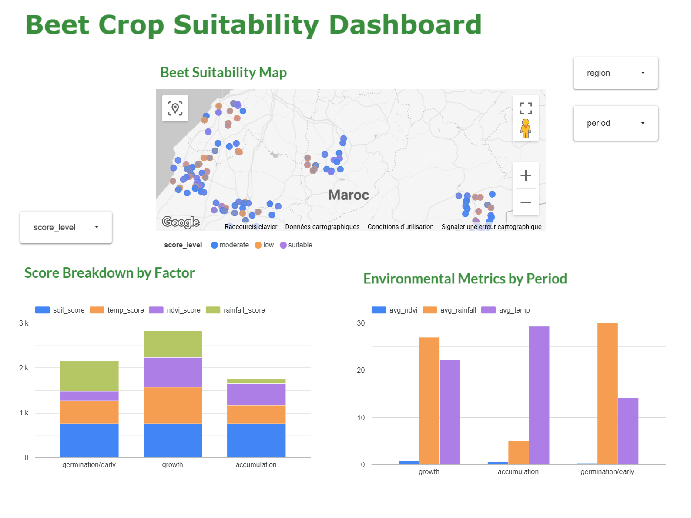

# Beet Land Suitability Analysis in Morocco

This project provides an end-to-end data engineering solution for assessing land suitability for beet cultivation in Morocco. It integrates satellite imagery, environmental data, and modern data stack tools to provide actionable insights for agricultural planning.

## Project Overview

The system automates the collection of environmental metrics (NDVI, Temperature, Rainfall, and Soil properties) and processes them through a structured data pipeline to calculate suitability scores across different agricultural periods.

### Key Features
- **Automated Data Ingestion**: Extracts multi-temporal environmental data from **Google Earth Engine (GEE)**.
- **Orchestration**: Managed workflows using **Apache Airflow** for reliable data pipelines.
- **Data Warehousing**: Scalable storage and processing in **Google BigQuery**.
- **Data Transformation**: Modular SQL modeling with **dbt Core**, implementing staging, intermediate, and mart layers.
- **Visual Analytics**: Interactive dashboards created in **Looker Studio** for spatial and temporal suitability analysis.

## Architecture

The architecture follows a modern data platform pattern:
1. **Extraction**: Airflow DAGs trigger GEE scripts to pull satellite and climate data.
2. **Loading**: Raw data is ingested into BigQuery.
3. **Transformation**: dbt models harmonize disparate datasets and apply weighted suitability logic.
4. **Visualization**: Looker Studio connects directly to BigQuery mart tables to visualize crop suitability.


## Visualizations

The project includes a comprehensive Looker Studio dashboard that provides:
- **Spatial Distribution**: A map of Morocco showing suitability scores by region.
- **Factor Analysis**: Breakdown of suitability by soil, temperature, NDVI, and rainfall.
- **Temporal Trends**: Environmental metrics compared across different agricultural growth stages.



## Project Structure

```text
beet_land_suitability/
├── airflow/
│   ├── dags/                       # Orchestration workflows
│   └── dags_dependencies/          # Utility scripts and geospatial data
├── dbt/
│   ├── models/                     # SQL transformation layers (Staging, Intermediate, Marts)
│   ├── seeds/                      # Static reference data (Thresholds)
│   ├── dbt_project.yml             # dbt configuration
│   └── profiles.yml                # BigQuery connection profiles
├── .github/
│   └── workflows/                  # CI/CD pipelines
├── Dockerfile                      # Airflow container configuration
├── docker-compose.yml              # Local environment setup
├── requirements.txt                # Project dependencies
└── looker_dashboard.png            # Dashboard screenshot
```

## Technologies Used

- **Python**: Core logic and data extraction.
- **SQL**: Data transformation and modeling.
- **Google Earth Engine**: Geospatial data source.
- **Apache Airflow**: Workflow management.
- **Google BigQuery**: Data warehouse.
- **dbt Core**: Data transformation tool.
- **Looker Studio**: Business intelligence and visualization.
- **Docker**: Containerization for consistent environments.

## Setup

1. **GCP Configuration**: Enable BigQuery and Earth Engine APIs.
2. **Credentials**: Place your GCP service account key as `gcp_key.json` in the root directory.
3. **Environment**: Configure the `.env` file with your `GCP_PROJECT_ID` and `BIGQUERY_DATASET`.
4. **Execution**: Run `docker-compose up --build` to start the Airflow environment.
